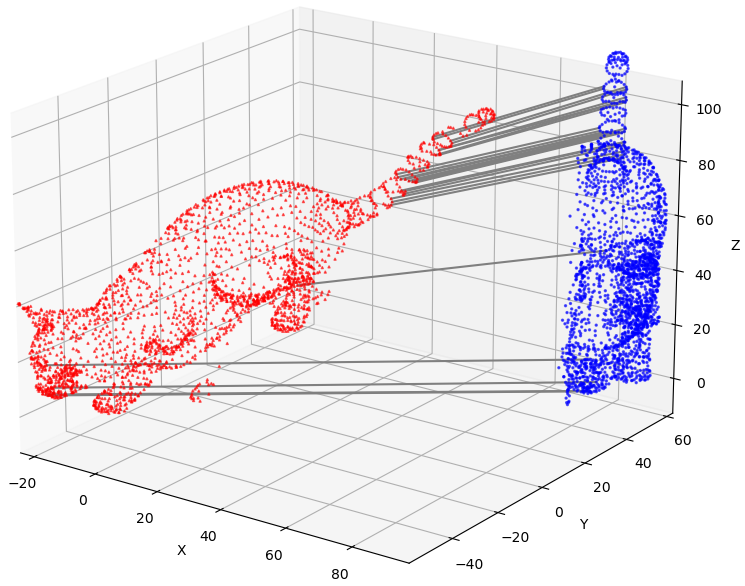
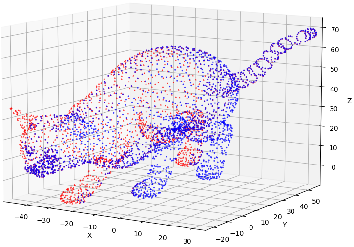

# Iterative Closest Point with Point-Feature-Histogram
#### ROB 422 Final
As point feature representations go, surface normals and curvature estimates are somewhat basic in their representations of the geometry around a specific point. Though extremely fast and easy to compute, they cannot capture too much detail, as they approximate the geometry of a point’s k-neighborhood with only a few values. As a direct consequence, most scenes will contain many points with the same or very similar feature values, thus reducing their informative characteristics.

# Project Description
In this project, we implement point feature histograms(PFH) for aligning point cloud data views into a consistent global model. Our algorithm estimates robust 8D features describing the local geometry of each point. These features are employed in an initial alignment algorithm to approximate a rigid transformation for registering input datasets. The algorithm offers effective starting points for iterative registration algorithms like Vanilla ICP (Iterative Closest Point) by transforming datasets to its convergence basin, which is ICP-PFH. We also compare our approach with Vanilla ICP, highlighting improvements and differences, particularly in cases unaddressed by Vanilla ICP methods.

[project report](report_img/Project_report_ICP_PFH.pdf)
# Installation
# Data Preparation
# Run
You can run the following command to run the demo of our code. The result will show up to the screen.
```
python demo.py
```
# Result
### Input point cloud and Correspondences find by PFH
 
### Matching result

# Acknowledgement
# References

